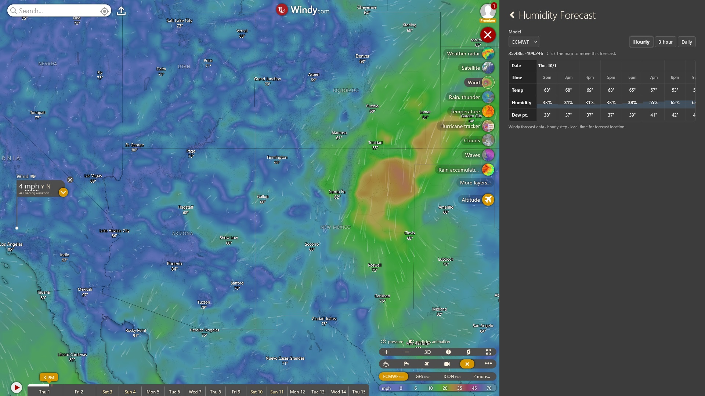

# Windy Humidity Forecast

A compact Windy.com plugin for humidity forecasts, with temperature and dew point. It uses Windy's own 5-day forecast data—no external weather service or separate weather API key.

## Features

- Easily find humidity forecast for an upcoming day and time
- Hourly, native 3-hour, and daily humidity high/low views
- ECMWF, GFS, and ICON forecast models
- Temperature, relative humidity, and dew point
- Temperature units inherited from Windy's preference
- Times local to the selected location
- Friendly place names alongside coordinates
- Desktop map-click and phone crosshair selection

## Location selection

**Desktop/tablet:** click the map to select a forecast location.

**Phone:** the panel opens half-height when Windy allows it. Move the map under the crosshair to choose a location; the first intentional pan establishes the forecast location. If the panel is fullscreen, drag it down halfway first. 

On phones, Windy’s initial map state can be ambiguous about which location should drive the forecast, so the plugin waits for the first intentional map movement instead of guessing. See [mobile location selection](docs/mobile-location-selection.md) for the rationale and interaction details.

## Forecast behavior

Hourly uses Windy's native step 1; 3-hour uses native step 3. Daily selects each day's actual hourly humidity high and low, showing their times, temperature and dew point in chronological order.

Times use the selected location's timezone, not device time. If it cannot be resolved, the plugin clearly labels UTC and offers a timezone retry. Place names aim for **City, State/Province** where possible, with coordinates always visible.

The initial view follows Windy's saved hourly/3-hour preference when enabled. View changes stay local to the plugin; temperature units are inherited when it opens.

## Screenshot



## Development

Use Node.js `22.23.2` or a compatible version that can import the TypeScript helpers in the tests.

```bash
npm install
npm start
```

Open Windy Developer Mode and load **https://localhost:9999/plugin.js**. You may need to accept the local development certificate once.

### Tests

```bash
node tests/forecast-requests.test.mjs
node tests/weather.test.mjs
npx tsc --noEmit
git diff --check
```

### Build

```bash
npm run build
```

On Windows, use `npm run build:win`. Build output goes to `dist/`.

## Technical documentation

- [Forecast behavior](docs/forecast-behavior.md): daily edge cases, data sources and request handling
- [Mobile location selection](docs/mobile-location-selection.md): drag-first selection and movement guards
- [Windy integration](docs/plugin-integration.md): preferences, panel behavior, lifecycle and optional diagnostics
- [Location names and timezones](docs/location-and-timezone.md): fixed-zoom naming and timezone fallbacks

Tested on desktop and in the native phone app. Broader device/layout testing is welcome; see the integration docs for runtime limitations.

## License

[MIT](LICENSE) · Copyright (c) 2026 markkn.
